

## Konfiguracja HTTPS - Serwer Caddy

**Ollama domyślnie udostępnia lokalne API przez HTTP na porcie 11434.**

SQL Server 2025 wymaga bezpiecznego endpointu HTTPS. 
Caddy będzie pełnił rolę reverse proxy, udostępniając Ollamę przez https://localhost:11435.

### 1. Test połączenia z Ollama

Sprawdź, czy lokalny endpoint Ollama działa przez HTTP:

(**curl** służy do wysyłania żądań HTTP/HTTPS z wiersza poleceń)

	curl -k http://localhost:11434

 
SQL Server wymaga endpointu HTTPS, dlatego przed Ollamą uruchomimy Caddy jako reverse proxy.

	curl -k https://localhost:11434

### 2. Pobierz Caddy
https://caddyserver.com/download i umieść w folderze SQL25_workshop zmieniając nazwę z 
caddy_windows_amd64.exe na caddy.exe

### 3. Sprawdź wersję Caddy

Uruchom Wiersz poleceń jako administrator i sprawdź wersję Caddy:

	caddy version

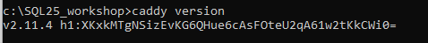
### 4. Uruchom reverse proxy

	.\caddy.exe reverse-proxy --from https://localhost:11435 --to http://localhost:11434
		
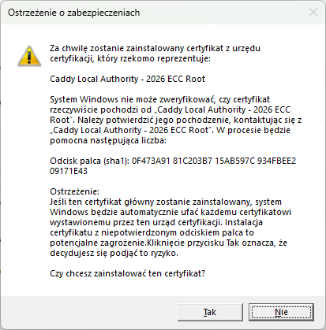
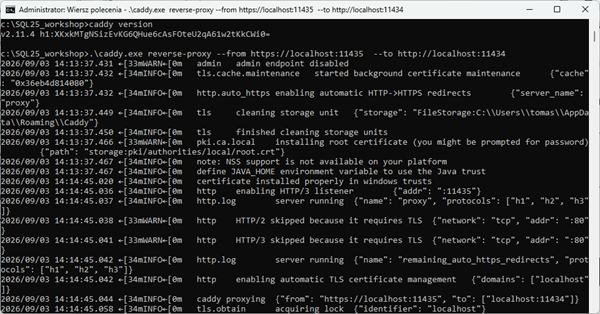

### 5. Ponownie sprawdź czy można połączyć się z Ollama

Otwórz nowy wiersz polecenia jako administrator i ponownie sprawdź czy można połączyć się z Ollama:

	curl -k https://localhost:11435

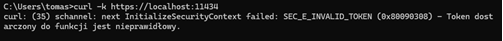

### 6. Sprawdź embedding

Sprawdź czy poniższe polecenie zwraca embedding (reprezentację numeryczną)

--ssl-no-revoke stosujemy wyłącznie diagnostycznie. Nie jest to docelowa konfiguracja dla SQL Servera.
	

	curl --ssl-no-revoke https://localhost:11435/api/embed -H "Content-Type: application/json" -d "{\"model\":\"all-minilm\",\"input\":\"SQL Server performance tuning\"}"

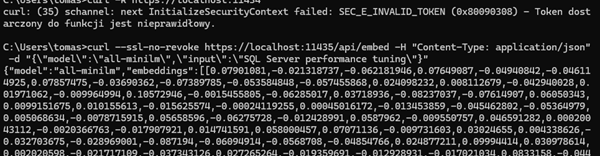

### 7. Test OpenSSL

Upewnij się, że OpenSSL został zainstalowany wraz z Git for Windows

	"C:\Program Files\Git\usr\bin\openssl.exe" version

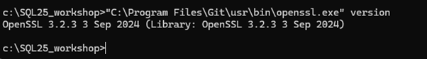

### 8. Utwórz katalog na certyfikat

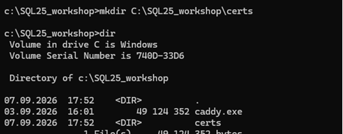

### 9. Utwórz plik openssl.cnf

Utwórz tam plik C:\SQL25_workshop\certs\openssl.cnf o poniższej zawartości

	[req]
	distinguished_name = req_distinguished_name
	x509_extensions = v3_req
	prompt = no

	[req_distinguished_name]
	C = PL
	ST = Malopolskie
	L = Krakow
	O = SQLDay
	OU = Workshop
	CN = localhost

	[v3_req]
	subjectAltName = @alt_names
	basicConstraints = critical,CA:TRUE
	keyUsage = critical,digitalSignature,keyEncipherment,keyCertSign
	extendedKeyUsage = serverAuth

	[alt_names]
	IP.1 = 127.0.0.1
	DNS.1 = localhost

### 10. Wygeneruj certyfikat i klucz prywatny

Przejdź do katalogu C:\SQL25_workshop\certs i wykonaj poniższe polecenia w celu wygenerowania certyfikatu i klucza prywatnego:

	"C:\Program Files\Git\usr\bin\openssl.exe" req -x509 -nodes -days 3650 -newkey rsa:2048 -keyout ollama.key -out ollama.crt -config openssl.cnf

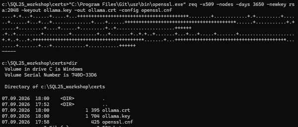

### 11. Dodaj certyfikat do zaufanych w systemie Windows 
(alternatywnie kliknij dwukrotnie na plik ollama.crt i wybierz "Zainstaluj certyfikat" - "Zaufaj"

 
	certutil -addstore -f Root C:\SQL25_workshop\certs\ollama.crt

Certyfikat jest dodawany do magazynu Trusted Root Certification Authorities komputera. 
Jest to certyfikat utworzony **wyłącznie na potrzeby lokalnego środowiska demonstracyjnego.**

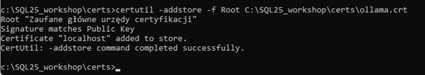

### 12. Utwórz plik Caddyfile 

Utwórz plik C:\SQL25_workshop\Caddyfile o poniższej zawartości:

	https://localhost:11435 {
    tls C:\SQL25_workshop\certs\ollama.crt C:\SQL25_workshop\certs\ollama.key
    reverse_proxy http://localhost:11434
	}

### 13. Uruchom Caddy z plikiem Caddyfile:
	
	.\caddy.exe run --config C:\SQL25_workshop\Caddyfile

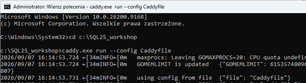

### 14. Sprawdź czy możesz połączyć się z Ollama przez Caddy:

Utwórz nowe okno wiersza poleceń i sprawdź czy możesz połączyć się z Ollama przez Caddy:

	curl -k https://localhost:11435

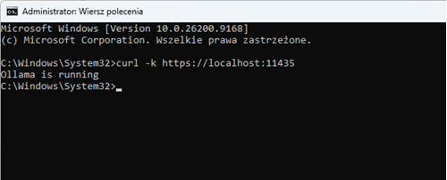

a następnie sprawdź czy poniższe polecenie zwraca embedding

	curl https://localhost:11435/api/embed -H "Content-Type: application/json" -d "{\"model\":\"all-minilm\",\"input\":\"SQL Server performance tuning\"}"

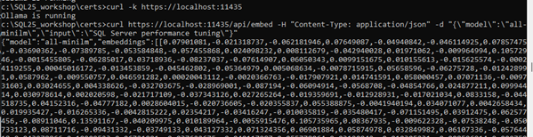

### 15. Architektura połączenia SQL Server 2025 z Ollama

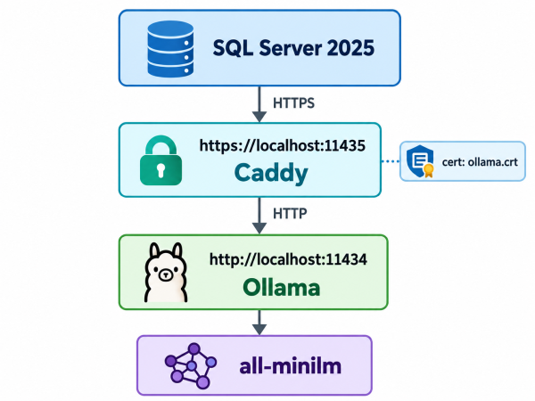

## Cleanup - Caddy

Po zakończeniu warsztatów możesz usunąć konfigurację HTTPS utworzoną na potrzeby połączenia SQL Server z Ollama.

### 1. Zatrzymaj Caddy

Jeśli Caddy działa w otwartym oknie konsoli, naciśnij:

    Ctrl+C

### 2. Usuń certyfikat z magazynu zaufanych certyfikatów Windows

Najpierw znajdź certyfikat:

    certutil -store Root localhost

Odszukaj wartość:

    Cert Hash(sha1)

Następnie usuń certyfikat, podając jego thumbprint:

    certutil -delstore Root "THUMBPRINT"

### 3. Usuń pliki Caddy i certyfikatu

Opcjonalnie usuń:

    C:\SQL25_workshop\caddy.exe
    C:\SQL25_workshop\Caddyfile
    C:\SQL25_workshop\certs\ollama.crt
    C:\SQL25_workshop\certs\ollama.key
    C:\SQL25_workshop\certs\openssl.cnf

