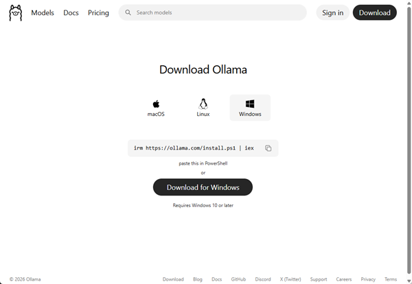
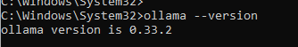
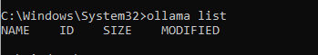
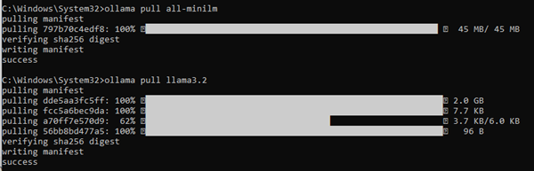
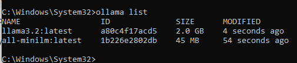
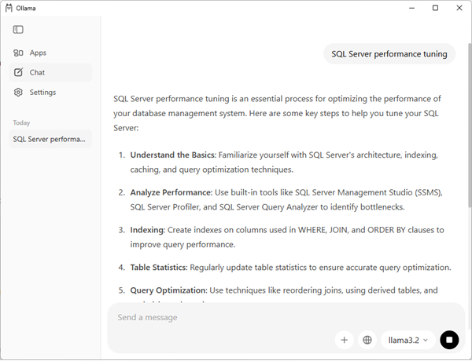
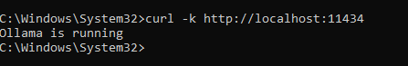
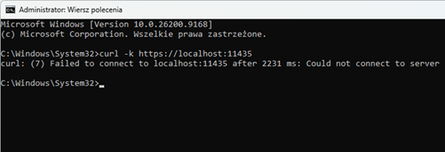

## Zainstaluj Ollama

### 1. Instalacja Ollama

Pobierz i zainstaluj Ollama (https://ollama.com/download) w wersji dla Windows.

Nie musisz się rejestrować jeśli korzystasz z modeli pobranych lokalnie. Wystarczy kliknąć "Continue without signing in".

Po instalacji otwórz wiersz poleceń i sprawdź czy Ollama działa:

	ollama --version

### 2. Sprawdź listę dostępnych lokalnie modeli

		ollama list

### 3. Pobierz modele

- all-minilm** (model do embedowania) 
- i opcjonalnie **llama3.2** (2GB, model generatywny, do czat)

		ollama pull all-minilm
	
		ollama pull llama3.2

### 4. Sprawdź ponownie listę dostępnych lokalnie modeli:

	ollama list

### 5. Przetestuj czat Ollama

Otwórz czat z modelem llama3.2 i wyszukując informację i "SQL Server performance tuning" sprawdź czy model odpowiada na pytania:
				

### 6. Aby usunąć wybrany model

Aby usunąć wybrany model wykonaj (nie usuwaj w tym momencie jeśli chcesz kontynuować laboratorium):

		ollama rm all-minilm

---

**Ollama domyślnie udostępnia lokalne API przez HTTP na porcie 11434**. 

SQL Server 2025 wymaga bezpiecznego endpointu HTTPS. 
Caddy będzie pełnił rolę reverse proxy, udostępniając Ollamę przez https://localhost:11435.

### Test połączenia z Ollama

**Sprawdź, czy lokalny endpoint Ollama działa przez HTTP:**

(**curl** służy do wysyłania żądań HTTP/HTTPS z wiersza poleceń)

	curl http://localhost:11434

 
**SQL Server wymaga endpointu HTTPS**, dlatego przed Ollamą uruchomimy Caddy jako reverse proxy.

	curl -k https://localhost:11434

